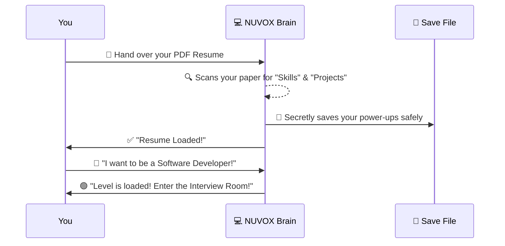
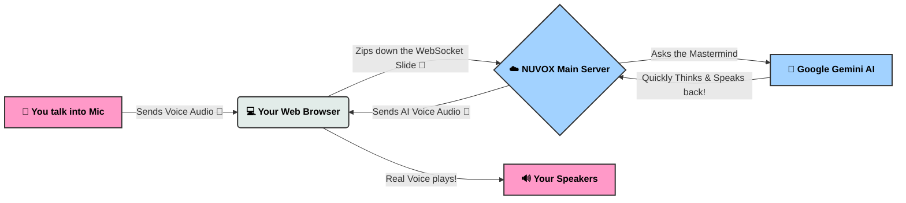
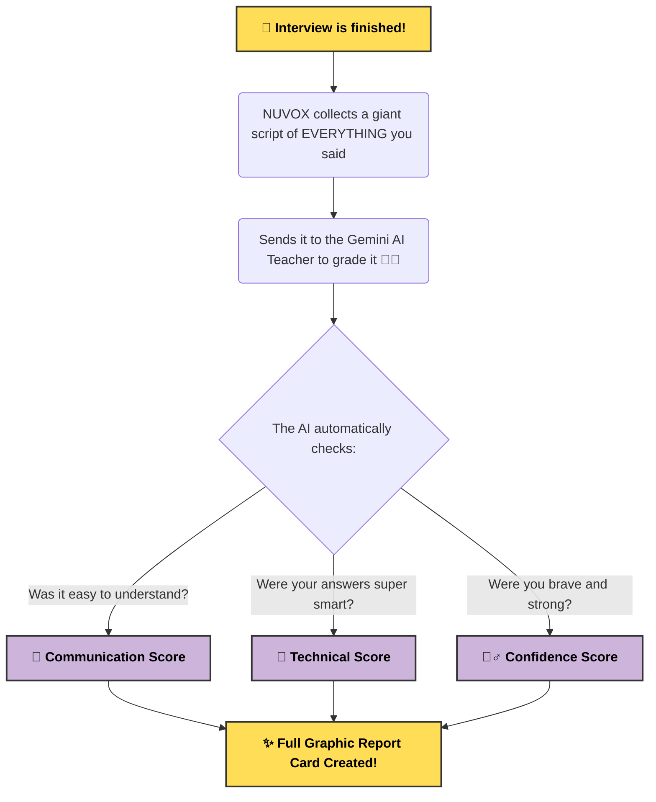

  <h1>🎮 NUVOX: The AI Interview Simulator</h1>
  <h3><i>Your Ultimate Mock-Interview Super-Buddy!</i></h3>
  
Practice any interview, anytime, safely from your room.

---

## 👾 The Problem: "Boss Fights" Are Scary
Have you ever played a video game and gotten super nervous before a big Boss Fight? That is exactly what Job Interviews feel like! Even grown-ups get extremely scared, their hands sweat, and they forget all the awesome things they know how to do.

But in video games, what if you could fight a "Practice Boss" first? You could learn their moves, test your skills, and make mistakes without losing the game! 

**That is why NUVOX exists.** It is your ultimate **Practice Arena**! You can practice interviewing safely, completely stress-free, until you feel like a total champion. 🏆

---

## 🦸‍♂️ NUVOX's Superpowers!
NUVOX isn't just a regular app—it's basically an incredibly smart robotic friend. Here is what it can do:

* 📄 **Super-Vision (X-Ray Reading):** You feed it a PDF of your resume, and NUVOX instantly scans it to learn your secret skills, like coding in Python, designing games, or building robots!
* 🎭 **Shape-Shifting:** Tell NUVOX what job you want (like a *Software Engineer* or a *Designer*), and it instantly transforms into the perfect boss to ask you questions.
* 🗣️ **Realistic Voice Chat:** No typing required! You talk into your microphone, and NUVOX listens. Then, it talks right back to you in real-time. It's just like talking to a friend on FaceTime!
* 📊 **The Ultimate Scoreboard:** At the end of the round, it grades you based on how confident you sounded and how smart your answers were, and tells you exactly how to level up next time.

---

## 🗺️ The Strategy Guide (How the Game Works)
*(Here is the exact step-by-step journey of how things happen behind the scenes!)*

### 🟦 Level 1: Character Select & Setup
When you first open NUVOX, here is how the computer gets ready for the game:

### 🟥 Level 2: The Live Action Walkie-Talkie
When you are in the voice room, you and the AI are using a blazing-fast "Walkie-Talkie" system. It is basically magic!

*Because it read your resume in Level 1, if you wrote that you build cool Lego robots, the AI Brain will literally ask you: "So, tell me about the hardest puzzle you solved while building your Lego robot!"*

### 🟨 Level 3: Getting Your Scoreboard
How do you get your final score and figure out how to improve?

---

## 🎒 What's in NUVOX's Backpack? (Tech Specs)
If you want to know what tools NUVOX uses to do all these cool tricks, peek inside the backpack:

* 🐍 **Python (FastAPI):** The super-fast engine running the whole game. It makes sure all the pieces connect perfectly.
* 🎢 **WebSockets:** Imagine a giant tube between your computer and our server. Once you connect, it stays completely open so you can talk back and forth instantly without hanging up!
* 🧠 **Google Gemini Live AI:** The brain of the operation. This is what listens to your words, thinks, and responds like a real human.
* 🌐 **Vanilla HTML/JS:** The beautiful screens and buttons you interact with. We use a cool trick called `getUserMedia` to politely ask your computer to use the microphone!
* 🗄️ **Local Database (JSON):** A safe little text file hidden away that stores your high scores!

---

  <h2>🌟 Ready to become an Interview Master?</h2>
  
<i>Start the application and jump into your first practice round!</i>

